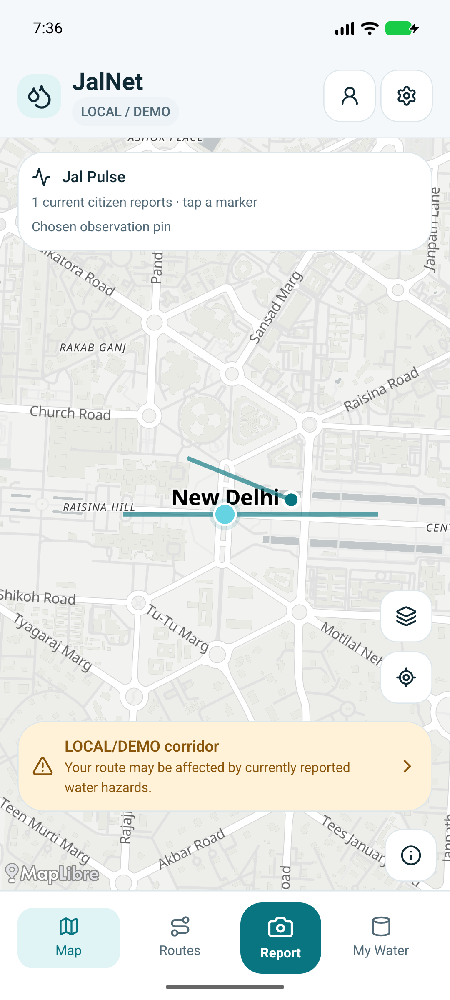
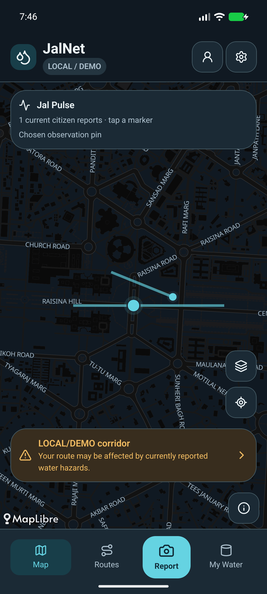

# JalNet

**Water reports, route warnings and Cedar-protected evidence.**

JalNet connects a citizen’s water observation to a human-confirmed incident and a warning for intersecting saved routes. The Android prototype keeps photo evidence private, shows report freshness and uncertainty, and records eligible contributions in a provisional droplet ledger.

This is a **LOCAL/DEMO Build It** submission using genuine AWS-origin **Cedar 4.13.0** for mandatory authorization. Local reports, incidents, route intersections and rewards execute actual application logic. Cloud deployment remains a separate, unverified path.

**Submission preparation is in progress. Final video: NOT RECORDED. Final Redmi acceptance and five timed rehearsals: PENDING.** [Submission package](docs/FINAL_SUBMISSION_PACKAGE.md) · [Current acceptance](docs/SUBMISSION_STATUS.md) · [Under-three-minute recording plan](docs/FINAL_DEMO_SCRIPT.md)

## The citizen workflow

1. Choose an observation pin and capture a JPEG.
2. Keep a private draft, upload locally and review the report. Local assessment requires manual classification; no image model runs.
3. Confirm category, qualitative severity, still-active status and public-road consent.
4. View the resulting **UNVERIFIED** incident and its freshness. Check the warning for a saved route and the eligible provisional contribution.

Confirmation, conservative incident fusion, expiry, duplicate-media checks, replay protection and the droplet ledger run locally. Public incidents omit private photos and contributor identifiers. A report or warning does not guarantee road safety. Local routes are **straight-line demo corridors**, not road directions.

| Other screens | Actual behavior |
|---|---|
| **My Water** | Enter capacity, level and daily use; calculate remaining litres and hours; persist valid values; explicitly simulate one day. The fixture 1,500 L / 60% / 300 L per day gives **900 L / 72h**, then **600 L / 40% / 48h** after simulation. Values are entered/demo assumptions, not sensor readings or a supply forecast. |
| **Water Stress** | Six fictional editable pressures produce a weighted **DEMO INDICATOR**, with visible contributions and missing-data coverage. It is not an official environmental measurement or validated scientific index. |
| **Appearance** | System, Light and Dark; persist the preference locally without clearing forms, selected pins or private drafts. Open Appearance from Settings, Profile or a sheet header. |
| **TankerOS / HeatSafe** | Fictional display-only supplier preview / planned feature. No booking, payments, contact, heat measurement or heat-aware routing. |

[Feature status](docs/FEATURE_STATUS.md) records delivered behavior and limits. IoT, predictive features, video uploads, push and background route learning remain future work.

## Actual Android screenshots

These are unedited emulator captures over real public basemap assets, with **synthetic LOCAL/DEMO reports and routes**. They are not a physical-device acceptance claim.

| Light | Dark |
|---|---|
|  |  |

The [33-image final acceptance pack](docs/ui/final-acceptance/README.md) adds actual capture/private-draft/offline/confirmation/ledger, calculator-edge, theme and enlarged-text evidence. The older [14-image evidence pack](docs/ui/submission/README.md) preserves routes, attribution and cold-restart observations. [UI redesign evidence](docs/UI_REDESIGN_REPORT.md) and [physical acceptance](docs/PHYSICAL_ACCEPTANCE.md) keep their tested environments separate.

## Run the local app

Use pinned **Node 24.21.0** and **pnpm 10.34.6**. The mobile stack is Expo 57.0.27, React Native 0.86.3, React 19.2.3 and MapLibre React Native 11.5.0. **An Expo development build is required** because Expo Go cannot run MapLibre.

For a fresh disposable emulator demonstration:

```sh
pnpm install --frozen-lockfile
pnpm demo:serve
```

In a second terminal:

```sh
pnpm mobile:start:local
```

The API listens on `127.0.0.1:8787`; the Android emulator uses `http://10.0.2.2:8787`. The explicit local preset selects LOCAL/DEMO mode without changing an ignored cloud `.env`. Open the installed development client and connect it to Metro.

For the first native build, configure JDK 17 and the Android SDK, then run `pnpm mobile:android`. The executed builds used Android 36, build-tools 36.0.0 and NDK 27.1.12297006. Generated native projects and portable tools are ignored; they are not checked-in dependencies.

For a USB-connected phone, approve USB debugging and use your configured `adb`:

```sh
adb -d reverse tcp:8787 tcp:8787
adb -d reverse tcp:8081 tcp:8081
pnpm demo:serve --android-usb
```

In the second terminal, use `pnpm mobile:start:usb`. Use the USB pair together so upload grants also address phone loopback. The development client requires Metro and the USB connection. Install compatible APK updates with `adb install -r` to retain app data. Follow the [device setup and acceptance guide](docs/BUILD_IT_DEVICE_DEMO.md); preserve wanted private drafts and their server evidence.

Light uses OpenFreeMap’s public Positron street style; Dark uses its bundled Dark descriptor with JalNet’s color adaptation. Tiles, glyphs and sprites still require internet. Fixed demo identities are local authentication inputs, not AWS credentials.

### Repeatable demo data

`pnpm demo:serve` starts one seeded corridor, no incidents and zero droplets in a new private temporary directory. It retains the directory and prints an exact `--resume` command for that take. It refuses an occupied port and does not delete `.local-data`, previous takes or phone drafts. **Do not switch servers while a wanted private draft depends on the previous server.**

To use existing persistent demo state instead, stop the disposable server and run `pnpm local:server` for the emulator or `pnpm local:server:usb` for the phone. `pnpm demo:seed` initializes its corridor without resetting existing data. `pnpm demo:reset` deletes `.local-data` and should be used only for disposable data after preserving wanted drafts and their evidence; seed/reset refuse to run while the localhost server is listening. My Water’s own reset changes only its account-scoped tank values.

Run `pnpm smoke --isolated` for a synthetic HTTP workflow in temporary state without replacing the active phone server or its drafts. Use the [five-rehearsal checklist](docs/FIVE_REHEARSALS.md) before recording.

## Demonstrate real Cedar authorization

AWS released the [Cedar policy language and authorization engine](https://aws.amazon.com/about-aws/whats-new/2023/05/cedar-open-source-language-access-control/) under Apache-2.0. JalNet loads the genuine pinned `@cedar-policy/cedar-wasm@4.13.0` Node/WASM engine before the local server can listen.

The [production policy](policies/private-reports.cedar) permits **ReadReport, PresignReport, CompleteUpload and ConfirmReport** only when the persisted report owner equals the authenticated principal. All four operations pass through `Application.ownedReport()`. The principal comes from the trusted server authentication boundary; ownership comes from persisted repository data. The original ownership comparison remains as defense in depth. Initialization, invalid-input, evaluation and policy-diagnostic failures close access; dependency errors are redacted. Cedar provides authorization; existing authentication is preserved.

```sh
pnpm cedar:demo
```

This judge proof uses the **real Cedar engine and actual HTTP requests** with isolated loopback servers, temporary storage and synthetic JPEGs. It checks all four owner operations, denies all four foreign operations with HTTP 403, then adds a **test-only forbid** to deny the otherwise permitted owner. It asserts that denial creates no grants, evidence reads, mutations, analysis calls, incidents or awards. It leaves the production policy and active demo data unchanged and prints no credentials or private diagnostics.

For the benchmark and dedicated regression proof:

```sh
pnpm cedar
pnpm exec vitest run tests/cedar-authorization.test.ts tests/cedar-http.test.ts --reporter=verbose
```

[Cedar integration evidence](docs/CEDAR_AUTHORIZATION.md) documents the validated schema, 40 actual-engine tests, HTTP denial proof and runtime measurements. This local integration does not establish AWS cloud execution or Lambda WASM packaging. Organizer eligibility confirmation is recorded separately in [submission status](docs/SUBMISSION_STATUS.md).

## Architecture and AWS cutover

**What runs locally:** Android capture/private draft → local HTTP authentication → mandatory Cedar for private-report operations → private local files and persisted reports → manual assessment/human confirmation → incident fusion/freshness and provisional ledger → saved-corridor intersection/route warning. SQLite holds mobile drafts, cache, appearance and account-scoped tank values; Stress inputs stay in screen memory.

**Preserved future cloud path — IMPLEMENTED_UNVERIFIED:** Cognito → API Gateway → Lambda → DynamoDB; private S3 presign/upload → SQS → Bedrock/Nova worker; human confirmation → incident/event API → Amazon Location Routes → warning and ledger. AWS provider interfaces, SDK implementations, CDK/IAM resources and account/role deployment guards remain intact. CDK is the only infrastructure framework.

Live AWS remains **BLOCKED_AWAITING_SSO**, intended profile `jalnet`, region `ap-south-1`. No Cognito, DynamoDB, S3, SQS, Nova or Amazon Location service is claimed verified; Cedar is not composed or verified in Lambda. The local demonstration works without AWS SSO.

The first command after SSO becomes available is:

```sh
aws sts get-caller-identity --profile jalnet
```

Compare the actual account and role privately and stop if they differ from the approved hackathon target. The [deployment runbook](docs/AWS_DEPLOYMENT_RUNBOOK.md) and [cutover checklist](docs/AWS_CUTOVER_CHECKLIST.md) require real deployment outputs, model/InvokeModel ARNs and restricted map configuration before cloud use. Live smoke requires explicit `--live`, `--profile jalnet` and a private approved-target configuration. Do not create or paste credentials; no AWS secret belongs in mobile configuration.

## Verification and recording status

```sh
pnpm format:check
pnpm lint
pnpm typecheck
pnpm synth
pnpm test
pnpm mobile
pnpm cedar
pnpm smoke --isolated
```

Synth precedes tests because infrastructure assertions inspect the generated CDK template. The sprint starting revision **57a4da6** reproduced **193 tests / 18 suites and all eight gates passing**. [Earlier 7be3368 CI](https://github.com/farhanakhtar0x66/jalnet-submission/actions/runs/37942059301) also passed. **The reviewed stabilization source `c2a8148` passed all eight gates with 212 tests / 23 suites at 21:18 IST.** This preserves all 193 baseline tests and adds 19 regression tests. See the [final engineering evidence](docs/FINAL_ENGINEERING_REPORT.md) and PR checks for final delivery verification. Automated results do not verify physical acceptance or AWS integration. SDK-mocked tests establish adapter behavior only.

The [final submission package](docs/FINAL_SUBMISSION_PACKAGE.md) contains the problem statement, architecture frame, honest feature disclosures and judge questions. The [recording script](docs/FINAL_DEMO_SCRIPT.md) targets 2:40–2:45. **Final video is NOT RECORDED; no video URL or completed form submission exists.** Latest Redmi camera/location/offline/accessibility acceptance and five timed physical rehearsals remain pending. JalNet P0 is not declared complete.

## Provenance, license and credits

This [submission repository](https://github.com/farhanakhtar0x66/jalnet-submission) restores the existing JalNet implementation. The [original source repository](https://github.com/farhanakhtar0x66/jalnet), its branches and PR #1 remain preserved. [Migration provenance](MIGRATION.md) distinguishes restoration commits from genuine later development; no original contribution history or artificial author dates are claimed here.

Farhan Akhtar supplied the specification, product requirements and earlier staged-phone checks. The team includes Aryanxp1 as leader and shubhrgunjan as another member. **OpenAI Codex assisted planning, implementation, tests, UI and documentation.** Individual contribution records remain in the original source history and migration documentation.

- JalNet: [MIT](LICENSE). Expo/650 Industries’ generated starter [MIT notice](apps/mobile/LICENSE) is retained.
- Cedar: Apache-2.0, with unmodified upstream [license, NOTICE and third-party material](third-party/cedar/README.md).
- Lucide: [ISC and Feather-derived MIT notices](third-party/lucide/LICENSE).
- Basemap: **OpenFreeMap · © OpenMapTiles · Data from OpenStreetMap**. Dark style/design also credits MapTiler/OpenMapTiles contributors, CartoDB, Stamen and Paul Norman, with JalNet’s color adaptation. [Retained style, font, icon and data notices](third-party/openfreemap-styles/README.md) include the BSD/Creative Commons licenses. The native popup shows the three standard data-source credits; complete Dark design credits remain in the distributed notices and recording description.

[Specification](JalNet_Implementation_Plan.md) · [Implementation status](docs/IMPLEMENTATION_STATUS.md) · [Decisions](docs/DECISIONS.md) · [Blockers](docs/BLOCKERS.md) · [Privacy](docs/PRIVACY.md) · [Backlog](TODO.md)
