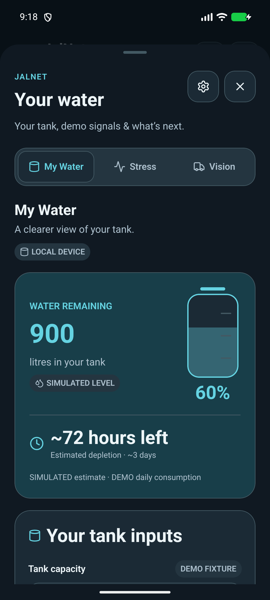
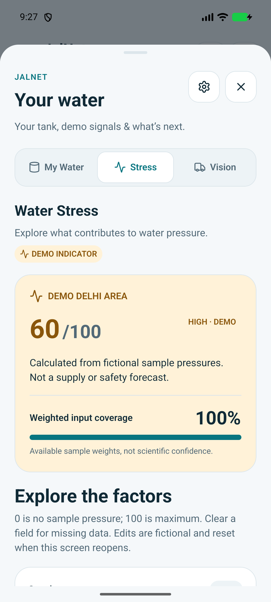
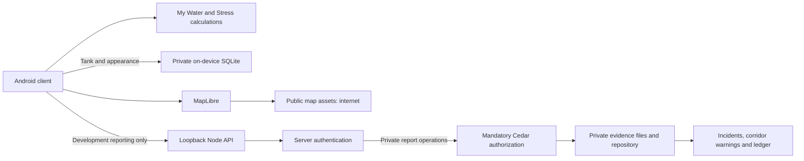
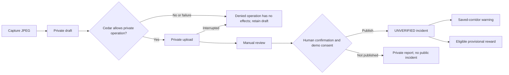
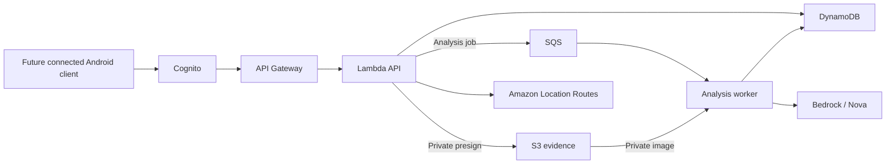

# JalNet

**Water observations, route warnings and private evidence protected by Cedar.**

JalNet connects a citizen's water report to a human-confirmed incident, freshness-aware saved-route warnings and an idempotent contribution ledger. The working reporting system runs with a **local Node API** and genuine AWS-origin **Cedar 4.13.0**. A separate Android preview is being prepared for friends who do not have that backend.

## Android preview

**Release preparation: IN PROGRESS. No verified download is published yet.** The intended prerelease is **v0.1.0-preview.1**, ARM64 only, package **org.jalnet.preview**. [Installation and feedback](docs/ANDROID_TESTING.md) · [Build and verification](docs/ANDROID_RELEASE.md) · [Release notes](RELEASE_NOTES.md)

| Capability | Standalone preview | Local development application |
|---|---|---|
| Street map and attribution | Public assets require internet | Same network dependency |
| Light / Dark / System | On-device; persistence must pass the exact release gate | Executed native evidence retained |
| My Water | On-device calculator, persistence and one-day simulation | Same calculated inputs; no meter |
| Water Stress | Computed DEMO INDICATOR from six fictional factors | Same demo arithmetic; no official feed |
| Camera, location, reports, routes, warnings and ledger | **Unavailable in this first preview** | Working in the documented local scope; requires Node/Metro |
| Cedar authorization | **Runs on the server, not in the preview phone** | Mandatory for private-report operations |
| TankerOS / HeatSafe | Fictional display-only preview / PLANNED | No booking, payments, contact or heat-aware routing |

The preview installs separately from `org.jalnet.mobile`; it does not migrate or overwrite that app's private drafts. Exact artifact metadata and release tests remain pending. It is not a completely offline app.

## Real Android UI

These are inspected **local-development emulator captures**, not proof of the forthcoming preview APK. [Complete evidence](docs/ui/final-acceptance/README.md)

| My Water | Water Stress |
|---|---|
|  |  |

My Water's 1,500 L / 60% / 300 L per day fixture computes **900 L / 72h**, then **600 L / 40% / 48h** after one simulated day. Stress exposes weights, missing-data coverage and its 60% minimum coverage. These are assumptions and fictional pressures, not sensors, environmental measurements or safety guarantees.

## Architecture

### Client and local backend

The preview uses the on-device/map branches. Reporting needs the separate loopback Node service; it is not a public testing API.



### Citizen reporting workflow — local Node required

Local assessment is manual; no image model runs. One report remains **UNVERIFIED**. Straight-line demo corridors are not road navigation.



### Future AWS — PLANNED / IMPLEMENTED BUT LIVE UNVERIFIED



AWS remains **BLOCKED_AWAITING_SSO**. SDK/CDK implementations and account/role guards are preserved; no deployed service or Cedar-in-Lambda execution is verified.

## Local development

Pinned stack: **Node 24.21.0 · pnpm 10.34.6 · Expo 57.0.27 · React Native 0.86.3 · MapLibre 11.5.0**. Use JDK 17 and the Android SDK for native builds.

```sh
pnpm install --frozen-lockfile
pnpm demo:serve
```

In another terminal, run `pnpm mobile:start:local` for an Android emulator. The development app requires an Expo development build: `pnpm mobile:android` builds it; Expo Go cannot run MapLibre. For a phone use `pnpm demo:serve --android-usb` with `pnpm mobile:start:usb` and the serial-specific USB setup in [the owner guide](docs/OWNER_FINAL_ACTIONS.md).

Fresh demo state is private and disposable. Retain its printed resume command; never switch servers while a wanted draft depends on the current server. `pnpm smoke --isolated` does not replace active demo state. **Do not expose the fixed-identity local API publicly.**

## Build the standalone preview

On macOS, configure JAVA_HOME for JDK 17 and ANDROID_HOME for the compatible Android SDK. With the owner's retained private signing material available:

```sh
pnpm android:preview
```

The wrapper uses an isolated build workspace; it does not convert the development app in place. Signing custody and [exact artifact gates](docs/ANDROID_RELEASE.md) are required. **Build/runtime verification and publication are still pending.**

## Tests and contribution

```sh
pnpm format:check
pnpm lint
pnpm typecheck
pnpm synth
pnpm test
pnpm mobile
pnpm cedar
pnpm smoke --isolated
pnpm cedar:demo
```

The prior engineering baseline at **c0f229a** retains **212 tests / 23 suites**. [Executed evidence](docs/FINAL_ENGINEERING_REPORT.md) distinguishes the local gate, real Cedar HTTP proof, native debug build and pending physical acceptance. Preview-specific regression, signing and exact release-APK runtime checks are still pending.

[Roadmap](TODO.md) · [Contributing](CONTRIBUTING.md) · [Feature status](docs/FEATURE_STATUS.md) · [Privacy](docs/PRIVACY.md) · [Submission materials](docs/FINAL_SUBMISSION_PACKAGE.md)

## Privacy, provenance and credits

Preview tank/preferences stay in its separate app storage. Public basemap requests go to external map providers. No automatic analytics or crash collection is introduced. The local backend uses fixed demo identities and unencrypted local files/SQLite; it is not a production service.

[MIT project license](LICENSE); retained [Expo starter notice](apps/mobile/LICENSE), [Cedar Apache-2.0 notices](third-party/cedar/README.md) and [Lucide ISC/Feather MIT notices](third-party/lucide/LICENSE). Map credits: **OpenFreeMap · © OpenMapTiles · Data from OpenStreetMap**. Dark style also credits MapTiler/OpenMapTiles contributors, CartoDB, Stamen, Paul Norman and JalNet's color adaptation; [source/design notices](third-party/openfreemap-styles/README.md) remain distributed.

[MIGRATION.md](MIGRATION.md) preserves transparent restoration provenance and the original source history. Farhan Akhtar supplied requirements and earlier physical checks; Aryanxp1 is the identified leader and shubhrgunjan another team member. **OpenAI Codex assisted planning, implementation, tests, UI and documentation.** Organizer approval is recorded separately. Live AWS, final physical demo, submission and JalNet P0 are not declared complete.
