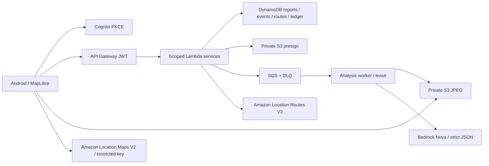

# AWS live rehearsal and separate local Build It gate

2026-10-08. **Do not record the final demo yet.** AWS remains **BLOCKED_AWAITING_SSO**; one physical Redmi staged-camera local flow passed, while the remaining device/permission/GPS matrix is pending. The separate [local Build It device handoff](BUILD_IT_DEVICE_DEMO.md) contains USB setup, reset/seed, Cedar proof, explicit disclosures and a planned **2:45** script. A local Build It submission can be prepared independently of AWS SSO, with its own device/participation/submission gates. The live shot list below remains blocked until actual cloud and physical acceptance. Neither path declares P0 complete. No video-report product feature, push, prediction, background tracking or P1/P2 work is included.

## Exact local reset and seed

1. Stop **only the JalNet localhost server you started** with Ctrl-C in its terminal. Confirm `lsof -nP -iTCP:8787 -sTCP:LISTEN` shows no listener; do not kill unrelated processes. Reset/seed refuse to operate while the server is listening.
2. From repository root, with the pinned Node/pnpm on PATH:

   ```sh
   pnpm demo:reset
   pnpm demo:seed
   pnpm local:server
   ```

   Reset deletes only ignored `.local-data` fixtures. Seed creates one `local-alice` **LOCAL/DEMO straight-line corridor** from (28.6139,77.205) to (28.6139,77.215), no observation, public event, analysis or points. No cloud deletion/write exists in these commands.
3. Choose a local rehearsal pin near (28.6139,77.209). Mobile mode must say **LOCAL / DEMO · AWS blocked awaiting SSO**; API `http://10.0.2.2:8787` for Android emulator. Run the existing native dev build with Metro: `pnpm mobile:start:local`. Keep the generated dev build's server connection at host port 8081 (`adb reverse tcp:8081 tcp:8081` if required). For a physical USB phone, use the paired `pnpm local:server:usb` / `pnpm mobile:start:usb` and reverse both 8787 and 8081 as detailed in the handoff. These explicit local presets preserve any cloud `.env`.
4. Clear a saved draft through Camera → Discard draft, confirming that it deletes the local image. Sign out clears the account session/query state. Drafts are now keyed by the authenticated account scope; old unscoped milestone drafts are retained privately and not automatically attributed to a live account. For a **deliberate clean reset of the dedicated emulator rehearsal app only**, run `adb shell pm clear org.jalnet.mobile`, then launch the installed dev build and reconnect Metro. This removes that app's local draft/cache/session/permission data, not any AWS data. Do not run it on a user's physical app containing wanted drafts.
5. In a second terminal, `pnpm smoke:local` executes two distinct generated JPEG fixture reports and assertions through the real localhost HTTP API. It expects the clean seeded server; do not run it after manual reports without repeating steps 1–2. Its console must say LOCAL/DEMO. It changes local fixture data; repeat reset/seed afterward for a clean interactive rehearsal.

Expected local HTTP identities: `LOCAL_DEMO_ALICE` → `local-alice`, `LOCAL_DEMO_BOB` → `local-bob`. They are narrowly accepted only by the localhost server and never accepted as AWS tokens. The mobile local mode uses Alice; Bob is exercised by the fixture smoke/test client. Before smoke: zero reports/events/droplets, Alice has one seeded corridor, Bob has no route. After smoke: one fused LOCAL incident, two distinct fixture reports, Alice 10 droplets/Bob 7, replay unchanged. These fixtures do not establish real independent witnesses.

## Live preparation, reset and seed boundary

There is **no live cloud reset/fixture seed command**. Do not bulk-delete tables, purge queues, remove evidence, reset balances or overwrite identities for a clean recording. Such work needs a separately reviewed owner-scoped procedure after the actual target account is known. Public incidents and audit history remain persistent; evidence follows the deployed 14-day lifecycle.

Exact safe live preparation after [AWS_DEPLOYMENT_RUNBOOK.md](AWS_DEPLOYMENT_RUNBOOK.md): match the private account/role, deploy/review outputs, restricted native map gate, independent probes and full HTTP workflow. Use two dedicated verified-email Cognito demo accounts and real current images/pins observed safely; never use the LOCAL demo headers or generated fixture images in AWS. Each **new workflow smoke** requires fresh accounts with zero ledger and no saved routes, as asserted by the script. A receipt's runId cannot be reused for writes. Use a new actual observation/location when previous incidents could affect fusion; do not relocate observations to force a result.

For a final interactive demo, separately verify fresh dedicated accounts' `/v1/me` and routes, then save one real road route intersecting the safely observed public-road issue. A second real independent observer may prepare a private fresh capture/assessment before filming, with no public confirmation or award yet. Keep that preparation visible in narration; do not suggest it was captured during the shot. No fake live seed exists. If the real scene/independent observer/route/phone is unavailable, the final live demo remains blocked; only a labeled LOCAL/DEMO rehearsal is permitted.

## Live AWS three-minute shot list (preparation only)

| Time | Shot and acceptance evidence |
|---|---|
| 0:00–0:15 | JalNet purpose + AWS architecture frame, label the actual build mode and current verification state. Show no account IDs, consoles with secrets, tokens, signed URLs or precise private trails. |
| 0:15–0:35 | Native attributed Amazon basemap after its real asset/key gate, current incident freshness/provenance, one manually chosen saved **Amazon road route**. No navigation/safety guarantee. |
| 0:35–1:10 | Safely capture a real current JPEG, resized/EXIF-stripped, persist private draft, upload via authenticated API presign → private S3. State image is still private and no reward/public event exists. |
| 1:10–1:35 | Actual queue/worker Nova draft with uncertainty; human chooses qualitative category/severity, confirms still-active/public-road consent and pin. Publish one unverified citizen incident; show provisional +2. If analysis falls back, say it explicitly and stop the live model success claim. |
| 1:35–2:05 | Second dedicated observer/account confirms their previously prepared actual distinct capture. Show two-photo fusion, community corroboration and persisted awards; narration distinguishes preparation from current shot. Never claim votes alone create corroboration. |
| 2:05–2:35 | Return to the saved actual road route; demonstrate current intersection warning with uncertain road conditions, incident category radius label and observed/expiry timestamps. No alternate route or safe-route prediction. |
| 2:35–2:50 | Ledger 10/7 for the clean two-account example, replay unchanged, no invented litres/depth/people-helped. |
| 2:50–3:00 | Privacy/uncertainty and honest tested-boundary statement; live acceptance evidence must match the exact recorded commit. |

If real timings exceed three minutes, rehearse five times after live acceptance and plan transparent cuts; never substitute fixture/model text or an old result as a current call. Freeze dependency versions and validate audio/network/battery/storage, permissions, retention, endpoint/model/key expiry and stable tag before the later recording. Final demo recording is still blocked now.

## What will be live or simulated

| Data/boundary | Current local rehearsal | Intended final live demo |
|---|---|---|
| Authentication | Fixed localhost Alice/Bob demo identities | Actual Cognito PKCE/access tokens; two real dedicated accounts |
| Basemap | Public OpenFreeMap Liberty / OpenMapTiles / OpenStreetMap street assets in existing MapLibre client; internet required | Amazon Location Maps V2 style/tile/sprite/glyph assets with validated restricted expiring key |
| Camera/location | Physical Redmi staged test-object capture/private local upload now passed; synthetic demo pin. Prior emulator/simulated GPS evidence remains separate | Physical Android capture and foreground GPS or honest user pin; no background route learning |
| Evidence/storage/queue | Local files/JSON persistence and synchronous local analysis | Private S3, DynamoDB conditional transactions, actual SQS → worker |
| Analysis | Deterministic uncertain/manual LOCAL/DEMO output | Actual Nova structured output, or explicitly failed/manual fallback |
| Incident/fusion/ledger | Real application logic over clearly simulated JPEG observations | Same domain logic over actual confirmed citizen observations; persisted real ledger |
| Saved route | Seeded/manual straight-line fixture corridor | Backend Amazon Location road geometry; actual intersection check |
| Road/environment certainty | Unknown; no inferred depth/contamination/safety | Unknown beyond visible qualitative observations; no predictive claims |

## AWS architecture frame



Frame caption: **Planned AWS P0 architecture — IMPLEMENTED_UNVERIFIED, live access BLOCKED_AWAITING_SSO** until actual evidence changes that state. Include this caption in the rehearsal. Explain human confirmation gates public events/rewards; Nova does not publish autonomously. Local providers remain labeled LOCAL/DEMO.

## Failure fallback instructions

- AWS/SSO or wrong identity: stop all dependent live actions; preserve private local drafts, show the blocker; switch to a separately built/labeled LOCAL/DEMO environment for rehearsal. Never rewrite a runtime failure to make AWS mode silently local.
- Upload/network interruption: preserve same private draft/report ID; retry upload or analysis scheduling when connected. If the report was already accepted, Finish / clear submitted draft removes only the local copy. Stale captures require retaking; accepted-report replay stays idempotent.
- Nova timeout/malformed output: show manual fallback, keep uncertainty, no AI-success claim or automatic publication. Direct live model probe must pass before final live demo eligibility.
- Maps key/assets/restrictions: show unavailable map state; do not remove restrictions or swap in MapLibre demo tiles while claiming Amazon rendering. Backend tests do not establish native key success.
- Route/provider failure: no route saved, current risk unavailable; retry after dependency recovery. Cached routes/reports are labeled with age, warnings suppressed when stale/offline, and no empty-result safety guarantee.
- No actual scene/independent observer/physical phone: remain blocked for final live demo. Use only the labeled local fixture rehearsal and architecture explanation.
