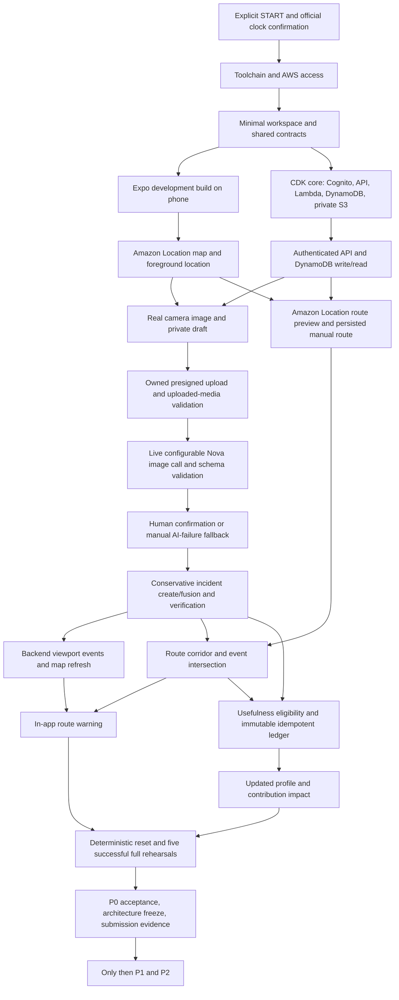

# JalNet implementation status

Planning audit: 2026-10-08, Asia/Kolkata. Source: [JalNet_Implementation_Plan.md](../JalNet_Implementation_Plan.md) (5,679 lines, numbered sections 0–100, including the addendum after the end marker). Explicit user instructions govern authorization and workflow; the plan supplies project requirements.

Implementation was authorized by explicit user **START**. The user subsequently directed autonomous local implementation while live AWS is **BLOCKED_AWAITING_SSO**, profile `jalnet`, region `ap-south-1`, and approved emulator testing until a physical phone is available. The repository is public; Aryanxp1 has write access and shubhrgunjan’s write invitation is pending.

Accepted core milestone before the new feature increment: native map/report/route/profile shell, strict contracts/domain rules, deterministic LOCAL/DEMO HTTP and file providers, AWS SDK providers and CDK infrastructure. Native Gradle APK build/install/runtime, emulator camera capture/private localhost upload, draft restart recovery, simulated foreground GPS and disk-backed offline cache have executed. P0 cutover hardening adds explicit configuration, private account/role guards, bounded staged smoke, failure injection and demo/runbook preparation. The approved narrow Cedar integration now makes real authorization mandatory for local private-report access. **12 suites / 111 tests passed at that milestone: all 71 baseline tests plus 40 Cedar tests**; exact results belong in [IMPLEMENTATION_REPORT.md](IMPLEMENTATION_REPORT.md). No AWS deployment or live integration has run; **P0 is not complete**.

**Build It strategy and feature history — 2026-10-08:** the owner selected local Cedar as the primary submission technology and explicitly authorized My Water, an explainable sample Water Stress calculator and disclosed TankerOS/HeatSafe previews. The earlier stretch-feature freeze was superseded for these features; Cedar remains frozen at 9422fc2. My Water has validated/persisted local state and actual arithmetic/simulation; Stress has weighted calculation/missing-data coverage; previews have no operational booking/safety behavior. **15 suites / 165 tests passed: 111 preserved plus 54 new tests**. See [current matrix](FEATURE_STATUS.md) and [original Aryan UI handoff](ARYAN_UI_HANDOFF.md). Visuals were initially assigned to Aryan; the later reassignment below supersedes that ownership. Owner testing/recording remains separate. SSO is not a primary-submission dependency; live AWS stays BLOCKED_AWAITING_SSO and optional Cedar Lambda remains unverified.

**Current UI redesign update — 2026-10-09:** the owner explicitly reassigned the visual work while Aryan is unavailable and authorized `ui/jalnet-redesign` from the verified feature commit **2dbbc4f**. Map/home, report/review, routes/profile/sign-in/configuration and all water/preview screens now use centralized Light/Dark tokens, real persistent **System / Light / Dark** selection and **Lucide** line icons. Water formulas, contracts, controller/storage, sample fixtures, Cedar and the future AWS architecture remain unchanged. The final current-source gate after all mobile fixes is **PASS: all eight local checks**, including **181 tests / 16 suites (all 165 preserved + 16 new theme tests)**, format/lint/types/synth/Android export, real Cedar check and isolated local smoke. Rebuilt arm64 APK/install and scoped owned-API37 emulator inspection are complete; exact observations are in [UI_REDESIGN_REPORT.md](UI_REDESIGN_REPORT.md) and the [35-capture after-design pack](ui/redesign/README.md). Unretaken native cases, full TalkBack, performance/offline/full permissions and redesigned physical Redmi checks remain PENDING; the phone battery died. No P0 completion or live AWS verification is claimed.

## Separate open-source and cloud acceptance gates

| Gate | Current evidence / status |
|---|---|
| Local Cedar runtime / required authorization | PASS locally: pinned 4.13.0 on Node 24.21.0; strict schema/policies; real owner allow/foreign deny; real HTTP owner forbid for all four actions with zero effects; redacted policy-error rejection. See [boundary audit](CEDAR_AUTHORIZATION.md). |
| Local regression / existing workflow | Final current-source gate after native polish PASS: all eight local checks, 181 tests / 16 suites, format/lint/types/synth/Android export, real Cedar check and isolated LOCAL/DEMO smoke. All 165 feature-baseline tests, including 40 Cedar tests, preserved; 16 theme tests added. AWS composition unchanged. |
| Recovered-draft mobile coordinate boundary | Native cold recovery exposed source/accuracy metadata in a strict coordinate request. Mobile restored-pin/confirmation payload now explicitly selects lat/lon and retains accuracy separately. Preserved-draft native HTTP confirmation PASS; all eight local checks rerun PASS at 181 tests / 16 suites. API/schema, storage/backend and Cedar unchanged; redesigned Redmi result still pending. |
| Scoped emulator appearance/map/water inspection | Exact three Appearance choices, overrides/System OS transitions and System/Light/Dark cold restarts PASS. Both maps and panned viewport/chosen pin/route retention PASS; new 48 dp popups both PASS with only three standard data-source credits visibly confirmed. Both profiles showed 4 droplets/+2/+2. Final Light tank cold restart restored 600 L/40%/~48h/day 1 at 1,500 L USER ENTERED capacity. Invalid 0 suppressed result/simulation and survived theme change; a valid intermediate 1 had saved, so original tank retention throughout editing is not claimed. Compact 840×1800/density420/font1.3 keyboard/warning/tabs/footer check PASS. Stress limited/missing/invalid, empty/zero-use not retaken; full TalkBack/physical/performance/offline/permission matrix remains PENDING. |
| Build It submission acceptance | One earlier real staged phone flow passed; redesigned APK build/emulator install passed. Redesigned Redmi matrix is pending while the phone is unavailable, alongside five timed rehearsals/final video and official kickoff/original-work timing/participation/student/submission review. Local runtime use does not certify overall eligibility. No final demo recorded. |
| Cedar in Lambda | Not composed/packaged/run; loader/WASM/policy assets and deployed Node24 runtime remain unverified. This optional future gate is separate from existing AWS authorization. |
| Existing live AWS P0 acceptance | **BLOCKED_AWAITING_SSO**, `jalnet`, `ap-south-1`; existing service/native Maps/physical-phone gates remain. No AWS row is promoted by Cedar. |

## Focused physical-device readiness

Accepted focused device increment (2026-10-08, before the new screens): authorization is **frozen at 9422fc2**. The read-only audit found no security defect. Explicit USB-local API/upload and mobile presets preserve both the emulator path and private future AWS configuration. A connected **Redmi Note 9 Pro Max reporting Android16/API36** installed/launched the existing development APK; the owner captured a real staged test object, uploaded a resized EXIF-free JPEG to localhost and manually confirmed Waterlogging. Actual local persistence and phone UI showed an UNVERIFIED incident, route warning and +2 provisional ledger. No real environmental observation or independent witness is inferred. Local street detail now uses OpenFreeMap; the AWS Maps branch is unchanged. Route-sheet refresh and readable placeholder are focused usability changes. [Device handoff and current planned 2:50 script](BUILD_IT_DEVICE_DEMO.md) contain disclosures and remaining owner tasks. Remaining physical permission/recovery/performance tests, five timed rehearsals and final recording are pending. **111 tests / 12 suites passed for that device increment; no tests were added then.** Live AWS and optional Cedar Lambda remain unverified.

## Repository publication history

- Initial planning commit: `dc26f9d31cd86dd59098fbb28b25f8fc92f1b7fe`.
- `gh repo create farhanakhtar0x66/jalnet --private --description ... --source . --remote origin --push` succeeded; `main` tracks `origin/main`.
- Initial GitHub REST repository metadata returned `private: true`, `default_branch: main` and the expected owner/repository URL.
- GitHub REST commit SHA matched `git rev-parse HEAD` for the initial push. The recursive remote tree contained exactly the seven intended files; every blob SHA matched `git ls-tree -r HEAD`.
- The supplied source plan was compared byte for byte with the original and remained unchanged. Local links, code fences, seven-file inventory, permitted status rows and a common credential-pattern scan passed.
- `git diff --cached --check` passed for newly authored files. The unchanged source plan retains its original Markdown hard-break spaces and final blank line, which the all-file whitespace check flags; it was not rewritten merely to remove them.
- The first proposed public create-and-push action was rejected by automatic approval review; private creation succeeded, followed by the user's temporary private-visibility instruction.
- The user later explicitly authorized making the repository public and inviting the team. `gh repo edit farhanakhtar0x66/jalnet --visibility public --accept-visibility-change-consequences` succeeded; GitHub metadata returned `private: false` and `visibility: public`.
- GitHub collaborator PUT requests and the subsequent invitations listing confirmed pending `write` invitations to `Aryanxp1` (invitation `336639451`) and `shubhrgunjan` (invitation `336639454`). Both accounts were verified before invitation. On the implementation milestone recheck, Aryanxp1’s permission endpoint returned write; only shubhrgunjan remains in the pending invitation list with write permission.

This is documentation/repository evidence only. The user selected MIT licensing during cutover cleanup. Final submission review and all live AWS product proofs remain incomplete.

## Initial audit evidence before repository publication

| Area | Observed result |
|---|---|
| Workspace | Initial `ls -la` showed only `.` and `..`; `rg --files --hidden -g '!.git' .` returned no files |
| Git | `git status --short --branch` and `git branch --all` each returned exit 128, not a Git repository; no `.git`, existing branches, remote, commits, or untracked Git state |
| Existing work | No mobile app, backend, infrastructure, manifests, lockfiles, configuration, tests, CI, generated files, or unfinished code |
| Instructions | No workspace `AGENTS.md`; no `AGENTS.md` found in inspected ancestor directories |
| JavaScript tools | `node --version`: `v26.10.0`; `npm --version`: `11.19.1`; `pnpm --version`: `11.25.0` through the bundled fallback; no project manager/version selected yet |
| AWS tooling | `aws` and `cdk` unavailable on PATH; conventional `~/.aws/config` and `~/.aws/credentials` absent; this does not prove other credential providers are unavailable |
| AWS resources/account | Not inspected or provisioned; credentials, Cognito, Location key, model access, IAM, quotas, and deployed endpoints remain unverified |
| Java | `java -version`: Temurin OpenJDK `25.0.4.1`; `/usr/libexec/java_home -V` listed a JRE; `javac -version` failed because no compiler-capable runtime was found |
| Android | SDK exists at `~/Library/Android/sdk`; platforms `android-34`, `android-35`, `android-37.0`; build-tools `34.0.0`, `36.0.0`; adb/emulator binaries exist but are absent from PATH |
| adb probe | Absolute-path `adb version` aborted attempting to create `~/.android` outside the permitted write roots; neither device connectivity nor an adb version was verified |
| Apple tooling | `/Applications/Xcode.app` absent; `xcodebuild -version` failed because active tools are CommandLineTools; local iOS build not available in this audited configuration |
| Device | Physical demo Android phone availability and connectivity not verified |
| Tests/builds | No runnable project exists; no formatter, lint, typecheck, unit/integration test, CDK synth, mobile build, or end-to-end test was run |

Tool presence is not runtime compatibility evidence. Select and pin compatible Node, package manager, Expo, React Native, MapLibre, JDK, Android, SDK, CDK, and Lambda runtime versions after authorization, using current official documentation.

## Dependency analysis

Critical path: real map → real capture → private S3 → live Nova assessment → human confirmation → incident create/fusion → map refresh → persisted saved-route intersection → route warning → useful contribution award. Auth, schemas, owned-media validation, verification, and idempotency are prerequisites across that path. Route creation can be prepared independently once the provider works, but route-risk acceptance also depends on incident fusion and event freshness.

## Proposed first milestone after START

Phase 0 is the integration proof from §99, preceded only by the minimum workspace/contracts/infrastructure needed to run it. The first 30 minutes are a diagnostic target, not a promise that provisioning/native builds finish within 30 minutes.

Exit evidence must include:

1. A real Expo development build installs and starts on the target phone.
2. MapLibre loads Amazon Location style, tiles, glyphs, and sprites using the restricted map key; attribution remains visible.
3. Foreground location works; denial still permits chosen-area use.
4. API Gateway/Lambda returns and protected requests use Cognito.
5. DynamoDB completes an actual write/read.
6. A phone image reaches private S3 by presigned PUT, with ownership/type/size checked after upload.
7. An available, configurable Nova model/inference profile receives a real image; returned text is parsed and validated against the assessment contract.
8. Amazon Location calculates a real route through the backend.

Record failures at the relevant boundary and continue independent authorized work. Elaborate UI and stretch features wait for these proofs. Follow with phases 1–7 from the user request: shell, event system, reporting, fusion, route intelligence, droplets, reliability. Run appropriate checks and update this matrix at each gate.

## P0 requirement matrix

Verification entries distinguish existing planning/repository evidence from required future product evidence. `VERIFIED` is reserved for executed checks or concrete inspected artifacts. Allowed statuses: `NOT_STARTED`, `IN_PROGRESS`, `BLOCKED`, `IMPLEMENTED_UNVERIFIED`, `VERIFIED`. Local evidence is recorded below; it never substitutes for a live AWS or physical-device acceptance test.

| ID | Requirement | Spec section | Priority | Dependencies | Status | Verification |
|----|-------------|--------------|----------|--------------|--------|--------------|
| GATE-01 | Explicit authorization and official project clock before implementation | Header, 1, 7, 46, 93, 94; user §§4,21 | P0 | User START | VERIFIED | User START authorizes implementation; exact organizer deadline remains a submission prerequisite |
| P0-001 | Git/workspace, package manager, reproducible compatible versions | 7, 46, 48 | P0 | GATE-01 | IMPLEMENTED_UNVERIFIED | Pinned workspace and frozen install pass locally and in GitHub CI; published remote SHA matched local commit 6bddc1c. |
| P0-002 | Shared strict Zod API/domain/media contracts | 8, 10, 43.2, 81 | P0 | P0-001 | IMPLEMENTED_UNVERIFIED | Strict assessment/upload/route schemas and executed contract tests. Endpoint coverage is still being completed; cloud acceptance pending. |
| P0-003 | Pure domain/geo functions and persistence/provider boundaries | 6.3, 28, 78 | P0 | P0-002 | VERIFIED | LOCAL ONLY: pure domain/geometry and provider interfaces exercised by executed domain/spatial/transaction tests; no AWS claim. |
| P0-004 | One infrastructure framework: CDK TypeScript | 7, 37, 77 | P0 | P0-001 | IMPLEMENTED_UNVERIFIED | Local code exists; full acceptance pending. AWS-dependent proof remains BLOCKED_AWAITING_SSO. See implementation report and tests for executed local evidence. |
| P0-005 | Expo development/native build on target Android phone | 6.1, 43.4, 94, 99 | P0 | P0-001; B-02; B-04 | IMPLEMENTED_UNVERIFIED | Existing development APK installed/launched on connected Redmi Note 9 Pro Max, reported Android16/API36, with USB API/Metro. One real staged-camera LOCAL flow passed; remaining full device/native AWS acceptance pending. |
| P0-006 | MapLibre with real Amazon Location dynamic Monochrome map | 6.2, 77, 97, 99 | P0 | P0-005; B-03 | IMPLEMENTED_UNVERIFIED | Local code exists; full acceptance pending. AWS-dependent proof remains BLOCKED_AWAITING_SSO. See implementation report and tests for executed local evidence. |
| P0-007 | Restricted expiring client map key; maps direct, routes backend | 97.2–97.3 | P0 | P0-004, P0-006 | BLOCKED | BLOCKED_AWAITING_SSO: maps URL/config exists; no real restricted expiring key has been provisioned or tested. |
| P0-008 | Cognito identity, API authorizer, owner isolation | 6.8, 31.5, 97.1 | P0 | P0-004; B-03 | IMPLEMENTED_UNVERIFIED | Local code exists; full acceptance pending. AWS-dependent proof remains BLOCKED_AWAITING_SSO. See implementation report and tests for executed local evidence. |
| P0-009 | API Gateway/Lambda and actual DynamoDB write/read | 6.3, 9, 37, 99 | P0 | P0-002, P0-004, P0-008 | IMPLEMENTED_UNVERIFIED | Local code exists; full acceptance pending. AWS-dependent proof remains BLOCKED_AWAITING_SSO. See implementation report and tests for executed local evidence. |
| P0-010 | Launch directly into quiet map; minimal navigation and center camera | 2, 4, 34, 35.3 | P0 | P0-005, P0-006 | IMPLEMENTED_UNVERIFIED | Native emulator launches into map; center camera, routes/profile/layers work locally. Full device/cloud acceptance pending. |
| P0-011 | Foreground-only location, permission primer, accuracy disclosure | 13.3, 31.3, 35.2 | P0 | P0-005 | IMPLEMENTED_UNVERIFIED | Native primer and deliberately simulated GPS fix passed (~5 m); bounded watch cleanup unit tests pass. Physical location denied/approximate/accuracy matrix pending. |
| P0-012 | Chosen-area/demo-area fallback and recenter | 0.2, 35.2, 36, 56 | P0 | P0-010, P0-011 | IMPLEMENTED_UNVERIFIED | Manual Delhi area fallback and native simulated-GPS recenter exercised; physical permission-denial matrix pending. |
| P0-013 | Canonical layer sheet and truthful feature availability | 4.3, 12, 35.6, 68 | P0 | P0-010, P0-002 | IMPLEMENTED_UNVERIFIED | Local code exists; full acceptance pending. AWS-dependent proof remains BLOCKED_AWAITING_SSO. See implementation report and tests for executed local evidence. |
| P0-014 | TanStack Query server state and small Zustand UI state | 79, 80 | P0 | P0-001, P0-002 | IMPLEMENTED_UNVERIFIED | Local code exists; full acceptance pending. AWS-dependent proof remains BLOCKED_AWAITING_SSO. See implementation report and tests for executed local evidence. |
| P0-015 | Event/report persistence, timestamps, point plus semantic radius | 8.1–8.2, 9, 83, 85, 86 | P0 | P0-002, P0-009 | IMPLEMENTED_UNVERIFIED | Local code exists; full acceptance pending. AWS-dependent proof remains BLOCKED_AWAITING_SSO. See implementation report and tests for executed local evidence. |
| P0-016 | H3 coarse index, neighboring cells, exact geometry filtering | 6.4, 9.1, 11, 15, 40 | P0 | P0-003, P0-015 | IMPLEMENTED_UNVERIFIED | Local code exists; full acceptance pending. AWS-dependent proof remains BLOCKED_AWAITING_SSO. See implementation report and tests for executed local evidence. |
| P0-017 | Bounded viewport API returning public map-card data | 10.2, 11.2, 88 | P0 | P0-008, P0-016 | IMPLEMENTED_UNVERIFIED | Local code exists; full acceptance pending. AWS-dependent proof remains BLOCKED_AWAITING_SSO. See implementation report and tests for executed local evidence. |
| P0-018 | Debounced padded viewport queries and cached layer keys | 11.1, 80, 88 | P0 | P0-014, P0-017 | IMPLEMENTED_UNVERIFIED | 400 ms debounce, 10% padding, coarse rounded bbox/layer query keys and SQLite cache authored; full pan/fanout/cloud performance acceptance pending. |
| P0-019 | GeoJSON source clustering and freshness/provenance markers | 11.3, 12, 89 | P0 | P0-006, P0-017 | IN_PROGRESS | Native clustered GeoJSON map rendered. Detail text distinguishes verification and observed time; full freshness/radius marker styling still incomplete. |
| P0-020 | Event detail, readable observations, sources, age and uncertainty | 35.5, 53, 55, 57, 89 | P0 | P0-019, P0-002 | IMPLEMENTED_UNVERIFIED | Local code exists; full acceptance pending. AWS-dependent proof remains BLOCKED_AWAITING_SSO. See implementation report and tests for executed local evidence. |
| P0-021 | Real camera JPEG capture; denial/settings and close paths | 13, 35.7, 43.4, 69 | P0 | P0-005, P0-011 | IMPLEMENTED_UNVERIFIED | Real Redmi capture/private localhost upload of an owner-staged harmless object passed. No actual hazard established. Physical denial/settings matrix still pending. Earlier emulator scene remains separate. |
| P0-022 | Image resizing/compression and configured hard limits | 13.2, 31.7, 38, 50 | P0 | P0-021 | IMPLEMENTED_UNVERIFIED | Real phone resized JPEG: 960×1280, 57,357 bytes, no EXIF marker; local media hash validated. 3.75 MB app cap / bounded decoder retained. One image is not varied-image/performance acceptance. |
| P0-023 | Private draft with capture/upload provenance and editable pin | 8.2, 13.3, 30.3, 83, 84 | P0 | P0-002, P0-011, P0-021 | IMPLEMENTED_UNVERIFIED | App-private JPEG + SQLite metadata/location survive restart; manual pin supported. Cloud/physical evidence provenance still pending. |
| P0-024 | Report state machine and idempotent legal transitions | 8.2, 41.1, 82 | P0 | P0-023, P0-003 | IMPLEMENTED_UNVERIFIED | Conceptual transition helper tested; final confirmation logically passes SUBMITTED and writes ACCEPTED/MERGED atomically (D-20). Cloud state/queue proof pending. |
| P0-025 | Private encrypted S3, Block Public Access and constrained IAM | 6.5, 31.4–31.5, 37.2 | P0 | P0-004 | IMPLEMENTED_UNVERIFIED | Local code exists; full acceptance pending. AWS-dependent proof remains BLOCKED_AWAITING_SSO. See implementation report and tests for executed local evidence. |
| P0-026 | Owned presign request, randomized key, short expiry and caps | 10.3, 31.7 | P0 | P0-008, P0-023, P0-025 | IMPLEMENTED_UNVERIFIED | Ownership/schema checks, random owned key, five-minute grant and transactional five/report + 100/day caps tested locally. Real S3 URL behavior blocked by SSO. |
| P0-027 | Real direct phone-to-S3 upload with progress and retry errors | 10.3, 13, 69, 99 | P0 | P0-022, P0-026 | IMPLEMENTED_UNVERIFIED | Physical Redmi expo/fetch File upload to private USB-loopback evidence passed for one staged capture. Busy/stage text and retained-draft retry remain. No real phone-to-S3 or byte-level progress proof. |
| P0-028 | Validate actual uploaded media before worker; completion trigger | 10.3, 14.1, 31.5 | P0 | P0-024, P0-027; B-05 | IMPLEMENTED_UNVERIFIED | Actual local JPEG size/header/decoder/hash checks executed; replaced evidence rejected by tests. Real S3/SQS completion/duplicate scheduling remains unverified. |
| P0-029 | Async analysis worker, bounded retry and polling | 14.1, 37, 41.1 | P0 | P0-028, P0-004 | IMPLEMENTED_UNVERIFIED | Local code exists; full acceptance pending. AWS-dependent proof remains BLOCKED_AWAITING_SSO. See implementation report and tests for executed local evidence. |
| P0-030 | Live configurable Nova image model/inference profile | 6.6, 14, 98, 99 | P0 | P0-029; B-03 | IMPLEMENTED_UNVERIFIED | Local code exists; full acceptance pending. AWS-dependent proof remains BLOCKED_AWAITING_SSO. See implementation report and tests for executed local evidence. |
| P0-031 | Conservative prompt and exact assessment contract | 8.3, 14.2–14.5, 26.2, 94 | P0 | P0-002, P0-030 | IMPLEMENTED_UNVERIFIED | Exact assessment schema/prompt authored; schema tests reject invented depth, extra fields and invalid confidence. Live model output safety remains unverified. |
| P0-032 | Parse/validate, at most one retry, manual failure path | 14.5, 36, 44.2, 69 | P0 | P0-024, P0-031 | IMPLEMENTED_UNVERIFIED | SDK-mocked malformed/schema retries bounded to two attempts; local/manual NEEDS_CONFIRMATION exercised natively. Real model timeout/throttle blocked by SSO. |
| P0-033 | Editable human confirmation and still-active check before publication | 13.4, 35.9, 83 | P0 | P0-032 | IMPLEMENTED_UNVERIFIED | Native category/severity/note/active/public-consent controls and private confirmation executed; public loop proven through local HTTP. Real AWS/phone acceptance pending. |
| P0-034 | Idempotent confirmation and transactional incident/report consistency | 10.3, 15, 41, 82 | P0 | P0-033, P0-015 | IMPLEMENTED_UNVERIFIED | Concurrent/replayed local confirmation tests create one incident/award; HTTP replay passed. Dynamo transaction implementation is unverified live. |
| P0-035 | Configurable type/distance/time fusion candidates and score | 15.1–15.2 | P0 | P0-016, P0-034 | IMPLEMENTED_UNVERIFIED | Executed local fusion tests cover type/time/ambiguous candidates; centralized prototype thresholds. Live H3 consistency/fusion proof pending. |
| P0-036 | Merge report count/freshness and robust severity aggregation | 15.3, 86 | P0 | P0-035 | IMPLEMENTED_UNVERIFIED | Local code exists; full acceptance pending. AWS-dependent proof remains BLOCKED_AWAITING_SSO. See implementation report and tests for executed local evidence. |
| P0-037 | System confidence independent of model confidence | 14.4, 53, 86 | P0 | P0-036 | IMPLEMENTED_UNVERIFIED | Local code exists; full acceptance pending. AWS-dependent proof remains BLOCKED_AWAITING_SSO. See implementation report and tests for executed local evidence. |
| P0-038 | Verification, conflicting observations and monitoring/resolution | 15.4, 30.6–30.7, 41.2, 54 | P0 | P0-036, P0-037 | IN_PROGRESS | Independent photo corroboration and concurrent clear votes tested locally. Complete contradictory-observation confidence/review policy still incomplete. |
| P0-039 | Basic independent confirm/cleared/not-sure; no self-confirmation | 5, 10.2, 30.6 | P0 | P0-008, P0-020, P0-038 | IMPLEMENTED_UNVERIFIED | Local tests reject self, remote, stale and repeated votes; two independent cleared votes resolve with no vote points. Live identity/proximity proof pending. |
| P0-040 | Logical event expiry while retaining incident history | 9.1, 30.7, 41.2, 59 | P0 | P0-038 | IMPLEMENTED_UNVERIFIED | Local code exists; full acceptance pending. AWS-dependent proof remains BLOCKED_AWAITING_SSO. See implementation report and tests for executed local evidence. |
| P0-041 | Immediately invalidate events, route risks and profile after confirm | 35.10, 80, 69 | P0 | P0-014, P0-034, P0-036 | IMPLEMENTED_UNVERIFIED | Native private confirmation returned to refreshed map without public event/extra points. Query invalidation authored; real AWS publish-to-map refresh pending. |
| P0-042 | Manual route origin/destination pins and named save workflow | 17.1, 35.11, 56 | P0 | P0-010, P0-012, P0-002 | IMPLEMENTED_UNVERIFIED | Local code exists; full acceptance pending. AWS-dependent proof remains BLOCKED_AWAITING_SSO. See implementation report and tests for executed local evidence. |
| P0-043 | Backend Amazon Location route preview, caching and rate limits | 10.4, 17.1, 88, 97.3, 99 | P0 | P0-008, P0-009; B-03 | IMPLEMENTED_UNVERIFIED | Routes SDK adapter, owner-scoped five-minute/200-entry warm cache and 30/day atomic attempts cap authored/tested. Real geometry/IAM proof blocked by SSO. |
| P0-044 | Private encoded route/corridor/bbox persistence and owner checks | 8.4, 9.3, 10.4, 31 | P0 | P0-042, P0-043 | IMPLEMENTED_UNVERIFIED | Local code exists; full acceptance pending. AWS-dependent proof remains BLOCKED_AWAITING_SSO. See implementation report and tests for executed local evidence. |
| P0-045 | Route deletion cancels its warnings; no background tracking | 18, 31.3, 60, 77 | P0 | P0-044 | IMPLEMENTED_UNVERIFIED | Local code exists; full acceptance pending. AWS-dependent proof remains BLOCKED_AWAITING_SSO. See implementation report and tests for executed local evidence. |
| P0-046 | H3 corridor candidates and exact point-to-segment/radius intersection | 17.2, 40.3 | P0 | P0-003, P0-016, P0-044 | IMPLEMENTED_UNVERIFIED | H3 viewport-bbox candidate lookup and exact every-segment corridor check tested locally. Dedicated long-route cell traversal optimization remains incomplete; real GSI queries unverified. |
| P0-047 | Severity/confidence/freshness route-risk threshold | 17.2, 19, 86 | P0 | P0-037, P0-040, P0-046 | IMPLEMENTED_UNVERIFIED | Local code exists; full acceptance pending. AWS-dependent proof remains BLOCKED_AWAITING_SSO. See implementation report and tests for executed local evidence. |
| P0-048 | Saved-route polyline, affected area and useful in-app warning | 17.4, 29.2, 35.4, 69 | P0 | P0-019, P0-047, P0-041 | IN_PROGRESS | Native saved-route line and actual LOCAL/DEMO API risk warning rendered. Approximate category-policy affected-area fill authored and native map inspected; real AWS route loop still pending. |
| P0-049 | Truthful lower-reported-risk wording and no dead Alternative action | 2.5, 17.3, 35.4, 61, 67 | P0 | P0-048, P0-013 | IMPLEMENTED_UNVERIFIED | Local code exists; full acceptance pending. AWS-dependent proof remains BLOCKED_AWAITING_SSO. See implementation report and tests for executed local evidence. |
| P0-050 | Immutable ledger and atomic idempotency independent of GSI uniqueness | 8.5, 9.4, 16, 82 | P0 | P0-002, P0-009 | IMPLEMENTED_UNVERIFIED | Local code exists; full acceptance pending. AWS-dependent proof remains BLOCKED_AWAITING_SSO. See implementation report and tests for executed local evidence. |
| P0-051 | Accepted relevant provisional value; verified/usefulness awards delayed | 2.6, 16.2, 35.10, 94.7 | P0 | P0-038, P0-047, P0-050 | IN_PROGRESS | Confirmed public nonduplicate reports earn capped provisional +2; two distinct photo identities unlock +8/+5 once, tested locally. Broader usefulness/route-impact reward eligibility remains incomplete. |
| P0-052 | Anti-farming: per-user repeats, caps, self-verify prevention, rate limits | 16.4, 30, 31.6, 69 | P0 | P0-039, P0-051 | IMPLEMENTED_UNVERIFIED | Local tests cover copied hashes, same-user farming, replay/concurrency, draft/upload/route caps and self-votes. Live abuse/quota tests pending; perceptual hash intentionally deferred. |
| P0-053 | Reversals use audit entries; trust separate from cosmetic rank | 16.3–16.4, 30.5, 60 | P0 | P0-050, P0-052 | IN_PROGRESS | Immutable negative reversal primitive and replay audit test pass; review-authorized reversal workflow/API is not implemented. Cosmetic rank is absent. |
| P0-054 | Profile balance/useful contributions and real impact update | 4.5, 35.15, 69 | P0 | P0-008, P0-041, P0-051 | IN_PROGRESS | Ledger-derived local profile tested; native balance/contribution history rendered. Impact counter remains zero/unimplemented, with no people/litres-saved claims. |
| P0-055 | Public incidents exclude identity, private routes and private-property precision | 31.1–31.4, 84 | P0 | P0-017, P0-023, P0-044 | IMPLEMENTED_UNVERIFIED | Local HTTP privacy assertions and native private confirmation pass: no public private incident or extra awards; internal identities/hashes omitted. Live authorization proof pending. |
| P0-056 | Originals/EXIF stay private; public preview optional and sanitized | 6.7, 31.4, 59 | P0 | P0-025, P0-028, P0-055 | IMPLEMENTED_UNVERIFIED | Native resized no-EXIF copy remains private; no original/public preview served. Real S3 access denial and retention are unverified. |
| P0-057 | Least-privilege roles, encryption, env separation and no secrets | 31.5, 37.2–37.3, 38, 97 | P0 | P0-004, P0-007, P0-008, P0-025 | IMPLEMENTED_UNVERIFIED | Local code exists; full acceptance pending. AWS-dependent proof remains BLOCKED_AWAITING_SSO. See implementation report and tests for executed local evidence. |
| P0-058 | Throttling, per-user limits, payload/media quotas and bounded H3 fanout | 31.6, 88 | P0 | P0-008, P0-017, P0-026, P0-043 | IMPLEMENTED_UNVERIFIED | Atomic draft/upload/route limits, payload/JPEG bounds, bounded H3 candidates and API stage throttles authored; local quota tests pass. Live quota and operational cost proof pending. |
| P0-059 | Canonical useful errors without stack traces or sensitive logs | 36, 39.1, 81 | P0 | P0-002, P0-009 | IMPLEMENTED_UNVERIFIED | Executed malformed/oversize JSON and dependency-redaction tests pass; no raw provider diagnostics exposed. Live log/error review pending. |
| P0-060 | Observability and honest health; no per-health Bedrock call | 39, 50 | P0 | P0-009, P0-030 | IN_PROGRESS | Health says dependencies not probed; logs retained one week; health never calls Nova. Structured operational metrics/alarms and deployed health proof pending. |
| P0-061 | Map loading, calm empty state, stale timestamps and network fallback | 32.2–32.3, 36 | P0 | P0-010, P0-018 | IN_PROGRESS | Native offline restart shows timestamp/current-conditions-unknown and suppresses current warning; transport mismatch fixed. Full empty/loading/stale/map-asset failure matrix pending. |
| P0-062 | Durable local draft/media metadata, retryable upload and cached route/events | 33, 43.4 | P0 | P0-023, P0-024, P0-027, P0-044 | IMPLEMENTED_UNVERIFIED | Native restart recovered draft/NEEDS_CONFIRMATION; SQLite owner-scoped event/route cache worked with API stopped. Full interrupted S3 upload/retry and cloud recovery pending. |
| P0-063 | Honest stage indicators and actionable camera/AI/route failure states | 35.8, 36, 69 | P0 | P0-024, P0-032, P0-043 | IMPLEMENTED_UNVERIFIED | Capture/upload/analyzing/manual/confirm states use actual API state; native stale-query recovery bug fixed. Full injected cloud failure matrix pending. |
| P0-064 | Performance budgets measured on target device and viewport backend | 11.3, 32, 88 | P0 | P0-018, P0-019, P0-048 | BLOCKED | Physical target performance deferred; emulator debug build is not timing/budget evidence. Live backend measurements blocked by SSO. |
| P0-065 | Accessible touch targets, labels, contrast and non-color status | 34.6, 57 | P0 | P0-010, P0-020, P0-033, P0-048 | IN_PROGRESS | 48 dp buttons, accessibility roles and labelled consent switches authored. Screen reader/text size/contrast and physical touch audit pending. |
| P0-066 | English copy keys, uncertainty/provenance, sparse-data Jal Pulse | 20, 53, 58, 61, 89 | P0 | P0-002, P0-019, P0-037 | IN_PROGRESS | Sparse Jal Pulse displays report summary with no fabricated numeric score; uncertainty/provenance text authored. Central English copy keys and complete copy audit pending. |
| P0-067 | Deterministic labeled demo seeds for one Delhi/NCR area and route | 42.1–42.2, 90 | P0 | P0-015, P0-044 | IN_PROGRESS | Executed deterministic LOCAL/DEMO Delhi corridor seed, deliberately no fabricated observations. Cloud seed/demo identity scope pending real resources. |
| P0-068 | Demo reset restricted to demo data and restores all implemented state | 42.3, 69, 90 | P0 | P0-050, P0-067 | IN_PROGRESS | Executed local reset/seed and active-server deletion refusal; only ignored .local-data is removed. Cloud/mobile complete-demo reset acceptance remains pending. |
| P0-069 | Live core remains real; recording-only AI fixture visibly disclosed | 44.2, 69, 90 | P0 | P0-030, P0-068 | BLOCKED | LOCAL/DEMO disclosure explicit everywhere; live core acceptance BLOCKED_AWAITING_SSO. No recording-only model fixture presented as real. |
| P0-070 | Fusion, verification, expiry, report transitions and route unit tests | 43.1; user §12 | P0 | P0-035, P0-038, P0-040, P0-046 | VERIFIED | LOCAL ONLY: executed domain/spatial/trust/application tests cover fusion, expiry, transitions, route geometry, copied media, concurrent votes and ledger idempotency. See nine-suite / 44-test result. |
| P0-071 | API/assessment valid, missing, unknown-category and confidence tests | 43.2 | P0 | P0-002, P0-031 | VERIFIED | LOCAL ONLY: executed strict schema suite covers valid/missing/extra/invalid category/confidence/upload inputs; no model/AWS success inferred. |
| P0-072 | S3-analysis, confirmed-report fusion, route warning and ledger integrations | 43.3 | P0 | P0-028, P0-030, P0-036, P0-048, P0-050 | BLOCKED | LOCAL/DEMO HTTP upload→manual→fusion→warning→ledger→replay passed with generated JPEG fixtures. Live S3/Nova/Dynamo/Cognito/SQS integrations BLOCKED_AWAITING_SSO. |
| P0-073 | Formatting, lint, typecheck, tests, synth and appropriate builds per phase | 43, 49; user §§12–13 | P0 | P0-001, P0-004, P0-005 | IN_PROGRESS | Final current-source gate after native polish PASS: all eight local checks, 181 tests / 16 suites, format/lint/types/synth/Android export/real Cedar/isolated local smoke. Rebuilt arm64 debug APK and owned API37 emulator install passed. Remaining native checks, redesigned Redmi and cloud gates pending; historical CI is separate. |
| P0-074 | CI install/typecheck/lint/unit/synth without broad PR deployment credentials | 49 | P0 | P0-073 | VERIFIED | LOCAL CHECKS ONLY: [GitHub run](https://github.com/farhanakhtar0x66/jalnet/actions/runs/37702139384) passed all steps on 6bddc1c, checks job 42 seconds; no AWS credentials or deployment. |
| P0-075 | Physical Android permission/offline/upload/AI/duplicate/layers/route matrix | 43.4–43.5 | P0 | P0-048, P0-054, P0-062, P0-063 | BLOCKED | One staged Redmi camera/upload/manual→warning/+2 flow passed; emulator recovery/cache/simulated GPS evidence remains separate. Full physical matrix and new-feature Redmi acceptance remain pending. |
| P0-076 | Five consecutive complete live rehearsals from clean demo reset | 42.3, 46, 69 | P0 | P0-068, P0-072, P0-075 | BLOCKED | Future live AWS rehearsals remain blocked by SSO. The primary Build It path has a separate five-timed-physical-rehearsal checklist, currently pending owner execution; HTTP smoke is not counted. |
| P0-077 | Budget/request/log controls and feature kill switches | 50, 67, 68 | P0 | P0-004, P0-013, P0-030 | IN_PROGRESS | Feature flags default off, API/worker/log and local provider-attempt caps authored. Real account budget/alarms/live-cost controls pending. |
| P0-078 | Architecture freeze after phone/map/API/S3/AI/fusion/route/reset proofs | 100 | P0 | P0-076 | BLOCKED | Architecture retained but not frozen: §100 requires the actual live proofs and five rehearsals still blocked. |
| P0-079 | README, architecture/privacy/source/demo docs and honest limitations | 62, 64, 65, 93 | P0 | P0-072, P0-075 | IN_PROGRESS | README/architecture/privacy/source links/demo instructions and local milestone report authored. Final live deployment/submission documentation pending. |
| P0-080 | Public repo, licenses, attribution and AI coding tool disclosure | 1, 48, 64, 93 | P0 | P0-001, P0-057, P0-079 | IN_PROGRESS | Public GitHub reverified; Aryanxp1 write active, shubhrgunjan write pending; Codex attribution/Expo starter license retained. MIT project license added at the user’s direction; final submission review pending. |
| P0-081 | Sub-three-minute video showing live critical loop and AWS | 63, 69, 93 | P0 | P0-076, P0-079 | BLOCKED | No live-AWS demo video recorded; blocked on SSO and complete rehearsals. No substitute recording claimed. |
| P0-082 | Final write-up/submission before verified official deadline | 1, 65, 93 | P0 | P0-080, P0-081; B-01 | NOT_STARTED | Exact official deadline/submission receipt not established; final write-up/submission has not run. |

## Deferred scope and acceptance gates

The original rule deferred P1 until live P0. The owner's later Build It strategy creates a narrow exception: My Water manual inputs/one-day simulation, weighted sample Water Stress and noninteractive TankerOS/HeatSafe previews. No telemetry baseline/anomaly detection, IoT, real reservation, heat scoring or wider P1/P2 system is authorized. Official alerts, video, push and route alternatives remain deferred. Basic independent incident confirmation stays in the existing core; the broader second-user workflow remains deferred.

P2/later: background route learning, HeatSafe, advanced DrainScan, supplier optimization, auto-reserve, sensor hardware, payments, municipal operations, predictive flood models, PostGIS migration, multi-city production. No custom tile server, Kubernetes, social feed/chat, CV training pipeline, elaborate admin suite, or speculative service sprawl.

Kill switches follow §68. Disabled stretch features must disappear or clearly state unavailability. Seeded incidents are disclosed; no live core dependency is replaced by an unlabeled simulation. Stress/tank tests in §43 apply when those deferred algorithms are implemented, not as a reason to build them before P0.

## Planning validation

Full spec/request read and initial read-only audit completed. Current official-source findings and unresolved interpretation details are recorded in `DECISIONS.md`; prerequisites and exact unblock actions are in `BLOCKERS.md`.

Executed a one-off Node stdin validation of the planning files: exactly three documents, 83 unique matrix rows (82 P0 requirements plus the authorization gate), seven columns per row, permitted statuses only, all referenced requirement dependencies present, pending evidence clearly labeled, no VERIFIED product rows, balanced code fences, blank lines after headings, and final newlines. Result: PASS, exit 0. `rg --files --hidden -g '!.git' .` listed only the three requested Markdown documents; repeat Git status/branch checks each returned exit 128 as expected. No product test/build/synth was run. These documentation checks cannot verify any product feature.

## Execution journal — START / local milestone

- Installed project-local Node 24.21.0 and pnpm 10.34.6. Corretto JDK archive checksum validated; javac 17.0.20.1 executed. Official Android 36 platform and command-line-tool SHA1 checks matched published metadata. Tools/caches are ignored.
- Strict contracts reject extra assessment keys, invented exact depth, invalid enums/confidence, oversize/type-invalid uploads, and unowned upload-key injection. Initial contract suite: 10 tests passed.
- Added provider/repository interfaces, local atomic file commits, report ownership/state guards, exact JPEG byte/decoder checks, human confirmation, conservative fusion, expiry, Google polyline conversion, route-segment warnings, immutable ledger primary-key guards, copied-image rejection and atomic daily provisional caps.
- AWS SDK v3 S3/Nova/Location/DynamoDB adapters and separate Lambda report/event/route/profile/analysis/health entry points are implemented but **UNVERIFIED**. No resource access or AWS credential probe occurred.
- Added CDK private encrypted retained bucket with 14-day raw evidence lifecycle, retained tables without canonical event TTL, Cognito client without secret, JWT-protected private routes, SQS/DLQ, bounded concurrency and scoped service IAM. `pnpm synth` succeeded locally; no deploy.
- Native Expo Android prebuild succeeded. Shared and mobile `pnpm typecheck` passed. `pnpm mobile:bundle` exported a Hermes Android bundle after correcting Metro's TS-source import resolution; bundling is not native runtime proof.
- Intermediate `pnpm test`: 20 tests passed across contract/domain/local integration suites. Further coverage and synthesized-artifact security tests are being added; final count/results are recorded in the implementation report.
- Tool failures addressed: initial workspace-root pnpm flag, a readonly fixture type, tsx IPC denied in sandbox (use `node --import tsx`), Metro `.js` imports into shared TS source, wrong relative JDK path, unavailable API34 phone-image package (used existing API37.1 phone emulator).
- Pending: actual native APK install/runtime/camera/location walkthrough; complete local API failure/recovery tests; final checks, commits/push. Live AWS and physical phone acceptance remain blocked, with no VERIFIED claim.

- Native Gradle `:app:assembleDebug --no-daemon` succeeded in 13m2s (338 tasks); `adb install -r` succeeded, and the actual JalNet native screen rendered MapLibre, saved-route geometry and the LOCAL/DEMO warning. Emulator exited during the first walkthrough, then restarted successfully with host graphics.
- LOCAL/DEMO `pnpm smoke:local` passed against the real localhost HTTP server using explicit generated JPEG fixtures: upload, manual classification, fusion, route risk, ledger and replay. This is neither camera nor live AWS evidence.
- Latest intermediate checks: formatter/lint pass, shared/mobile typecheck pass, six suites / 33 tests pass; CDK synth and Android Hermes bundle export pass. `CI=true pnpm install --frozen-lockfile` passed. Default `pnpm smoke:aws` intentionally exits2 with BLOCKED_AWAITING_SSO and no AWS calls.

### Final local reliability evidence

- Native camera captured a simulated emulator JPEG (14,020 bytes, 1,280×1,102, no EXIF marker); private upload and manual NEEDS_CONFIRMATION rendered. Restart restored the draft without reuploading; private confirmation created no public incident and no additional droplets.
- API-offline app restart read SQLite cache and displayed dated reports/current conditions unknown, with no current route-risk guarantee. Native fetch initially used Error rather than TypeError; an explicit transport boundary fixed fallback. Retry control is now available.
- Foreground simulated GPS returned Delhi coordinates with approximately 5 m accuracy. Bounded watch removes subscriptions on fix/error/timeout; two mocked timing/cleanup tests passed. No physical location claim.
- Local HTTP smoke passed again from a stopped-server reset/seed using the updated code. Reset attempted while server active exited1 as intended without deleting data.
- Added evidence-hash continuity checks, canonical JSON errors, transactional upload/route quotas, immutable reversal primitive and scoped IAM/Routes ARN assertions. Nine suites / 44 tests passed at the latest execution. Final commands and CI outcome belong in IMPLEMENTATION_REPORT.md.

- Final local gate: format/lint/shared+mobile types/CDK synth/Hermes export PASS; nine suites / 44 tests PASS. Analysis lease, public filtering before response cap and approximate-radius geometry tests added. AWS smoke guard exits2 without calls. Local HTTP smoke passed against final source after clean reset/seed.

- Public implementation push succeeded (32ac62a → 6bddc1c); local/remote SHA matched. [GitHub CI](https://github.com/farhanakhtar0x66/jalnet/actions/runs/37702139384) completed successfully: all local validation steps passed, checks job 42 seconds. AWS integrations remain IMPLEMENTED_UNVERIFIED/BLOCKED_AWAITING_SSO.

### P0 cutover readiness gate

- Full boundary/config/IAM/payload/failure/test/live-command audit, guarded deployment runbook and unrecorded demo preparation added. Target/model/resource values remain actual private deployment inputs, never invented defaults.
- Configuration, identity, controlled capture, same-subject account and malformed key expiry/caller guards added; smoke stages remain bounded and perform independent probes before application writes. No live command executed or status promoted.
- Local fixes cover interrupted upload/scheduling retry, stale/future captures, timed-out/malformed model and route providers, application JWT-shaped rejection, offline redaction and account-scoped drafts/cache. Scoped Lambda logging is asserted on actual synthesized IAM.
- Final current gate passed: format/lint/types/synth, **10 suites / 71 tests (27 added)**, Android Hermes export and clean-seeded local HTTP smoke. Updated emulator capture/manual screen and freshness/provenance card rendered in LOCAL/DEMO. Detailed executed evidence is in IMPLEMENTATION_REPORT.md.
- MIT added at the user's direction. P1/P2 remain frozen; AWS BLOCKED_AWAITING_SSO and final live demo/physical acceptance gates remain blocked.

### Approved narrow Cedar integration

- Before changing application behavior, an isolated scratch install of Cedar 4.13.0 loaded/evaluated on pinned Node 24.21.0, darwin/arm64: schema strictly validated, owner allowed, foreign principal denied. Import 25.12 ms, initial validation 81.69 ms; no AWS calls.
- Added typed ReportAuthorizer and mandatory local composition; `ownedReport()` obtains owner/resource exclusively from Repository and evaluates ReadReport/PresignReport/CompleteUpload/ConfirmReport. Trusted server identity mapping, original owner comparison, canonical 401/403/404 and all existing providers/cloud infrastructure remain.
- Forty dedicated actual-engine tests pass (22 adapter/engine, 18 HTTP). Explicit forbids deny otherwise permitted owners before grant/write/worker/fusion/award; accepted replay and conflict return cannot use a weaker action. Real overflow diagnostics reject engine Allow with redacted 503.
- Complete regression **12 suites / 111 tests** passes, preserving every baseline test. Format/lint/types/synth/Android bundle and existing clean local smoke pass. `pnpm cedar:check`: 138.40 ms initialization, 1.042 ms median/2.016 ms p95 over 1,000 actual decisions (500 allow/500 deny), local-machine measurements only.
- Preserved upstream Apache-2.0 license/notice material separately from project MIT. Local Build It technical evidence and pending submission gate stay separate from live AWS/P0 acceptance. No final recording, P1/P2 work or Cedar-in-Lambda claim.
